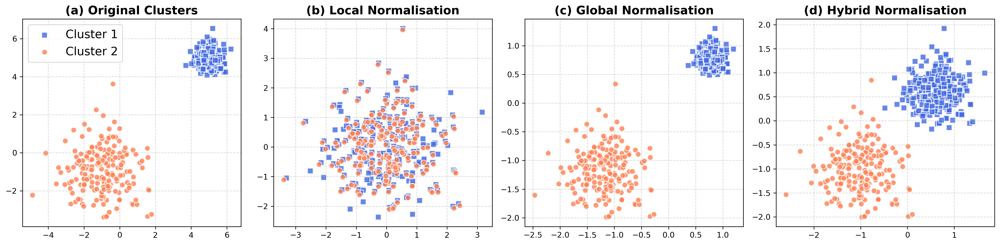
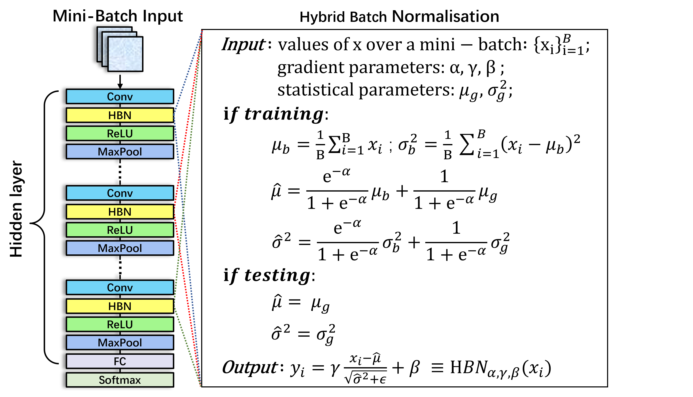

# Introduction
This is the implementation of our paper: Hybrid Batch Normalisation: Resolving the Dilemma of Batch Normalisation in Federated Learning (accepted by ICML 2025).

**(a) Original Clusters**:
Cluster 1 (blue squares): 300 samples centered at [5, 5] with a tight standard deviation of  0.4; 
Cluster 2 (coral circles): 200 samples centered at [-1, -1] with a wider standard deviation of 1.2.

**(b) Local Normalistion**:
Each cluster is normalised independently using its own local statistics. 

**(c) Global Normalistion**:
Both clusters are normalised using the global statistics. 

**(d) Hybrid Normalistion**:
Each cluster is normalised by a specific mixture of local and global statistics. 
Cluster 1: 70% reliance on local statistics, 30% on global statistics; Cluster 2: 30% reliance on local statistics, 70% on global statistics

**Hybrid normalisation combines global statistics with local statistics, which can standardise the size of two clusters while maintaining the global structure.**

# Hybrid Batch Normalisation

The specific code implementation can be found in <a href="./FedBaseline/models/FedHBN/MyBNtool.py" target="_blank" title="HBN">./FedBaseline/models/FedHBN/MyBNtool.py</a>.

# Citation
